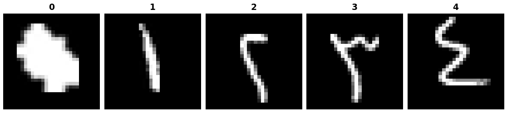

Arabic Digits
=============

.. raw:: html

   

   
   
   
   

Overview
--------

The Arabic Handwritten Digits dataset is a single-label image classification benchmark consisting of 70,000 handwritten digit images across 10 classes (0–9). Images are provided as 28×28 grayscale PNGs. The dataset was written by 700 participants from different institutions to ensure diversity in handwriting styles, with each digit written ten times per writer. Derived from the MADBase database.

- **Train**: 60,000 images (6,000 per class)
- **Test**: 10,000 images (1,000 per class)

Data Structure
--------------

When accessing an example using ``ds[i]``, you will receive a dictionary with the following keys:

.. list-table::
   :header-rows: 1
   :widths: 20 20 60

   * - Key
     - Type
     - Description
   * - ``image``
     - ``PIL.Image.Image``
     - 28×28 grayscale handwritten digit image
   * - ``label``
     - int
     - Class label (0-9)

Usage Example
-------------

**Basic Usage**

.. code-block:: python

    from stable_datasets.images.arabic_digits import ArabicDigits

    # First run will download + prepare cache, then return the split as a HF Dataset
    ds_train = ArabicDigits(split="train")
    ds_test = ArabicDigits(split="test")

    # If you omit the split (split=None), you get a DatasetDict with all available splits
    ds_all = ArabicDigits(split=None)

    sample = ds_train[0]
    print(sample.keys())  # {"image", "label"}

    # Optional: make it PyTorch-friendly
    ds_train_torch = ds_train.with_format("torch")
    ds_test_torch = ds_test.with_format("torch")

References
----------

- Official website: https://github.com/mloey/Arabic-Handwritten-Digits-Dataset

Citation
--------

.. code-block:: bibtex

    @inproceedings{el2016cnn,
      title={CNN for handwritten arabic digits recognition based on LeNet-5},
      author={El-Sawy, Ahmed and Hazem, EL-Bakry and Loey, Mohamed},
      booktitle={International conference on advanced intelligent systems and informatics},
      pages={566--575},
      year={2016},
      organization={Springer}
    }

