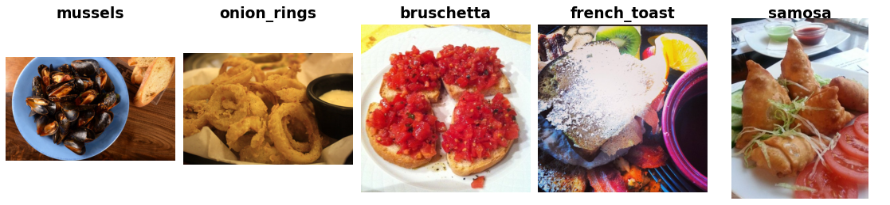

Food-101
========

.. raw:: html

   

   
   
   
   

Overview
--------

The Food-101 dataset is a large-scale image classification benchmark for single-label food recognition.
It contains **101 food categories** with **1,000 images per class**, resulting in **101,000 images** in total.

The dataset is intentionally designed to reflect real-world conditions. While the **test set is manually
reviewed and cleaned**, the **training set is left noisy**, containing mislabeled samples and images with
strong color distortions. This makes Food-101 particularly suitable for evaluating robustness and
generalization in visual recognition models.

- **Train**: 75,750 images (750 per class, noisy)
- **Test**: 25,250 images (250 per class, manually reviewed)

All images are RGB and were rescaled so that the **maximum side length does not exceed 512 pixels**, while
preserving the original aspect ratio.

Data Structure
--------------

When accessing an example using ``ds[i]``, you will receive a dictionary with the following keys:

.. list-table::
   :header-rows: 1
   :widths: 20 20 60

   * - Key
     - Type
     - Description
   * - ``image``
     - ``PIL.Image.Image``
     - RGB image with maximum side length ≤ 512 pixels
   * - ``label``
     - int
     - Class label in the range ``[0, 100]``

Usage Example
-------------

**Basic Usage**

.. code-block:: python

    from stable_datasets.images.food101 import Food101

    # Load training split
    ds = Food101(split="train")

    # Load all splits as a DatasetDict
    ds_all = Food101(split=None)

    sample = ds[0]
    print(sample.keys())  # {"image", "label"}

    # Optional: make it PyTorch-friendly
    ds_torch = ds.with_format("torch")

References
----------

- Official website: https://data.vision.ee.ethz.ch/cvl/datasets_extra/food-101/
- License: Research use (as provided by the original authors)

Citation
--------

.. code-block:: bibtex

    @inproceedings{bossard2014food,
      title     = {Food-101 -- Mining Discriminative Components with Random Forests},
      author    = {Bossard, Lukas and Guillaumin, Matthieu and Van Gool, Luc},
      booktitle = {European Conference on Computer Vision},
      year      = {2014}
    }
