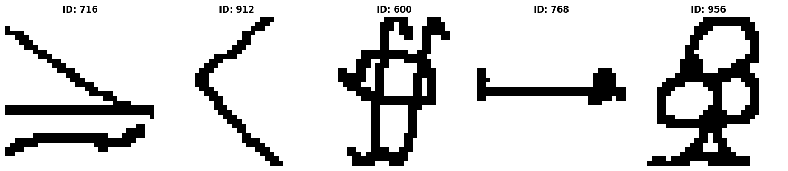

HASYv2
======

.. raw:: html

   

   
   
   
   

Overview
--------

The HASYv2 dataset contains 168,236 handwritten symbol images spanning **369 classes**. It includes Latin characters, numerals, and a wide variety of mathematical and scientific symbols (e.g., Greek letters, operators). The dataset is designed to benchmark classification algorithms on symbols with high intra-class variability and visual similarity.

The dataset is structured into **10 pre-defined folds** for Cross-Validation. You can select a specific fold using the configuration name (``fold-1`` to ``fold-10``).

.. list-table::
   :header-rows: 1
   :widths: 20 60 20

   * - Config Name
     - Description
     - Split Ratio
   * - **fold-1**
     - Standard benchmark split (Default)
     - ~90% Train / 10% Test
   * - **fold-2**
     - Cross-validation split #2
     - ~90% Train / 10% Test
   * - ...
     - ...
     - ...
   * - **fold-10**
     - Cross-validation split #10
     - ~90% Train / 10% Test

All images are 32×32 black-and-white (binary/grayscale).

Data Structure
--------------

When accessing an example using ``ds[i]``, you will receive a dictionary with the following keys:

.. list-table::
   :header-rows: 1
   :widths: 20 20 60

   * - Key
     - Type
     - Description
   * - ``image``
     - ``PIL.Image.Image``
     - 32×32 grayscale handwritten symbol image
   * - ``label``
     - int
     - Class label (0-368). Maps to the symbol ID (e.g., "31" for '1').

Usage Example
-------------

**Basic Usage**

You can specify a ``config_name`` to choose which cross-validation fold to use. If not specified, it defaults to ``"fold-1"``.

.. code-block:: python

    from stable_datasets.images.hasy_v2 import HASYv2

    # Load the standard benchmark split (Fold 1)
    ds_train = HASYv2(config_name="fold-1", split="train")
    ds_test = HASYv2(config_name="fold-1", split="test")

    # Load a specific fold for cross-validation
    ds_train_f5 = HASYv2(config_name="fold-5", split="train")

    sample = ds_train[0]
    print(sample.keys())  # {"image", "label"}
    
    # Get the actual symbol ID string (e.g., "31")
    label_id = ds_train.features["label"].int2str(sample["label"])
    print(f"Symbol ID: {label_id}")

References
----------

- Official website: https://github.com/MartinThoma/HASY

Citation
--------

.. code-block:: bibtex

    @article{thoma2017hasyv2,
      title={The hasyv2 dataset},
      author={Thoma, Martin},
      journal={arXiv preprint arXiv:1701.08380},
      year={2017}
    }