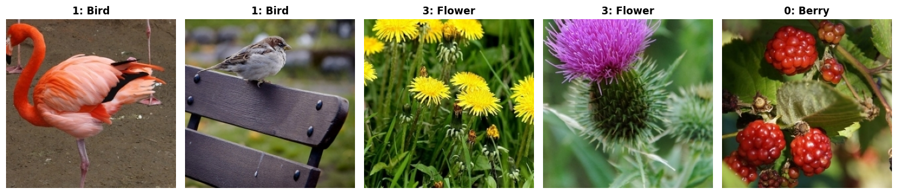

Linnaeus 5
==========

.. raw:: html

   

   
   
   
   

Overview
--------

The Linnaeus 5 dataset is a fine-grained image classification benchmark consisting of 8,000 RGB images across 5 classes: *berry*, *bird*, *dog*, *flower*, and *other*. Images are provided as 256×256 pixels. A unique feature of this dataset is the inclusion of a "negative" class (*other*) to test object recognition capabilities.

- **Train**: 6,000 images (1,200 per class)
- **Test**: 2,000 images (400 per class)

Data Structure
--------------

When accessing an example using ``ds[i]``, you will receive a dictionary with the following keys:

.. list-table::
   :header-rows: 1
   :widths: 20 20 60

   * - Key
     - Type
     - Description
   * - ``image``
     - ``PIL.Image.Image``
     - 256×256 RGB color image
   * - ``label``
     - int
     - Class label (0-4)

Usage Example
-------------

**Basic Usage**

.. code-block:: python

    from stable_datasets.images.linnaeus5 import Linnaeus5

    # First run will download + prepare cache, then return the split as a HF Dataset
    ds_train = Linnaeus5(split="train")
    ds_test = Linnaeus5(split="test")

    # If you omit the split (split=None), you get a DatasetDict with all available splits
    ds_all = Linnaeus5(split=None)

    sample = ds_train[0]
    print(sample.keys())  # {"image", "label"}
    print(f"Label: {sample['label']}") # e.g., 0 (Berry)

    # Optional: make it PyTorch-friendly
    ds_train_torch = ds_train.with_format("torch")
    ds_test_torch = ds_test.with_format("torch")

References
----------

- Official website: http://chaladze.com/l5/

Citation
--------

.. code-block:: bibtex

    @article{chaladze2017linnaeus,
      title={Linnaeus 5 dataset for machine learning},
      author={Chaladze, G and Kalatozishvili, L},
      journal={chaladze.com},
      year={2017}
    }