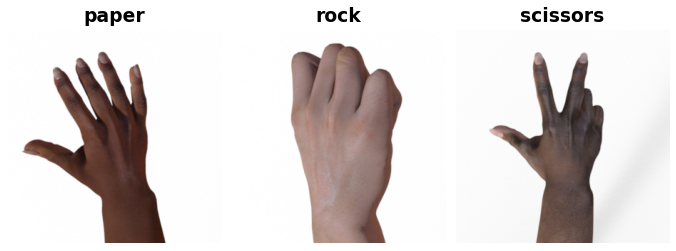

Rock Paper Scissor
==================

.. raw:: html

   

   
   
   
   

Overview
--------

The Rock Paper Scissors dataset contains images of hands posed into rock, paper, or scissor gestures. The dataset features hands from various races, ages, and genders, providing diversity in the training examples.

- **Train**: 2,520 images (840 per class)
- **Test**: 372 images (124 per class)

Data Structure
--------------

When accessing an example using ``ds[i]``, you will receive a dictionary with the following keys:

.. list-table::
   :header-rows: 1
   :widths: 20 20 60

   * - Key
     - Type
     - Description
   * - ``image``
     - ``PIL.Image.Image``
     - RGB image of hand gesture (variable size)
   * - ``label``
     - int
     - Class label: 0 (rock), 1 (paper), 2 (scissors)

Usage Example
-------------

**Basic Usage**

.. code-block:: python

    from stable_datasets.images.rock_paper_scissor import RockPaperScissor

    # Load the training split
    ds = RockPaperScissor(split="train")

    # Access a single sample
    sample = ds[0]
    image = sample["image"]  # PIL Image
    label = sample["label"]  # 0, 1, or 2

    print(f"Dataset size: {len(ds)}")
    print(f"Label: {label}")

**With PyTorch**

.. code-block:: python

    from stable_datasets.images.rock_paper_scissor import RockPaperScissor
    import torch
    from torch.utils.data import DataLoader

    # Load dataset and format for PyTorch
    ds = RockPaperScissor(split="train").with_format("torch")

    # Create a DataLoader
    dataloader = DataLoader(ds, batch_size=32, shuffle=True)

    for batch in dataloader:
        images = batch["image"]
        labels = batch["label"]
        # Your training loop here
        break

**Class Labels**

.. code-block:: python

    from stable_datasets.images.rock_paper_scissor import RockPaperScissor

    ds = RockPaperScissor(split="train")

    # Get class names
    class_names = ["rock", "paper", "scissors"]
    
    sample = ds[0]
    label_idx = sample["label"]
    print(f"Gesture: {class_names[label_idx]}")

Dataset Details
---------------

- **Source**: Laurence Moroney's Rock Paper Scissors Dataset
- **Homepage**: https://laurencemoroney.com/datasets.html
- **License**: CC BY 2.0
- **Image Format**: PNG, RGB color
- **Image Sizes**: Variable (typically 300×200 pixels)
- **Total Images**: 2,892 images (2,520 train + 372 test)

Citation
--------

.. code-block:: bibtex

    @misc{laurence2019rock,
        title={Rock Paper Scissors Dataset},
        author={Laurence Moroney},
        year={2019},
        url={https://laurencemoroney.com/datasets.html}
    }

Related Datasets
----------------

- Hand gesture recognition datasets
- Sign language datasets
