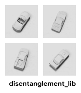

SmallNORB
=========

.. raw:: html

   

   
   
   
   

Overview
--------

The **SmallNORB dataset** is a real-world benchmark designed for **disentangled and unsupervised representation learning** on **3D objects** under controlled but realistic variations. It was introduced by **LeCun et al. (2004)** to study **object recognition invariant to pose and lighting**.

Each example consists of a **stereo image pair**, capturing the same object from two horizontally displaced cameras.

- **Total images (train)**: 24,300 stereo pairs  
- **Total images (test)**: 24,300 stereo pairs  
- **Image resolution**: 96×96 (grayscale)

Latent Factors of Variation
--------------------------

Each stereo pair is annotated with five discrete factors of variation:

.. list-table::
   :header-rows: 1
   :widths: 20 40 40

   * - Factor
     - Discrete Values
     - Description
   * - ``category``
     - {0, ..., 4}
     - Object category (airplane, car, truck, human, animal)
   * - ``instance``
     - {0, ..., 9}
     - Specific object instance within a category
   * - ``elevation``
     - {0, ..., 8}
     - Camera elevation angle
   * - ``azimuth``
     - {0, ..., 17}
     - Camera azimuth angle (originally 0, 2, …, 34)
   * - ``lighting``
     - {0, ..., 5}
     - Lighting condition index

Each sample corresponds to a **single observed configuration** of these factors.  
The dataset **does not enumerate all possible combinations**, reflecting the constraints of real-world data collection.

Data Structure
--------------

When accessing an example using ``ds[i]``, you will receive a dictionary with the following keys:

.. list-table::
   :header-rows: 1
   :widths: 25 20 55

   * - Key
     - Type
     - Description
   * - ``left_image``
     - ``PIL.Image.Image``
     - Left view grayscale image (96×96)
   * - ``right_image``
     - ``PIL.Image.Image``
     - Right view grayscale image (96×96)
   * - ``label``
     - ``List[int]``
     - Discrete latent indices: ``[category, instance, elevation, azimuth, lighting]``
   * - ``category``
     - ``int``
     - Object category index
   * - ``instance``
     - ``int``
     - Object instance index
   * - ``elevation``
     - ``int``
     - Elevation index
   * - ``azimuth``
     - ``int``
     - Azimuth index
   * - ``lighting``
     - ``int``
     - Lighting condition index

Usage Example
-------------

**Basic Usage**

.. code-block:: python

    from stable_datasets.images.smallnorb import SmallNORB

    # Load training split
    ds = SmallNORB(split="train")
    ds_test = SmallNORB(split="test")

    # Load both splits
    ds_all = SmallNORB(split=None)

    sample = ds[0]
    print(sample.keys())

    left_image = sample["left_image"]
    right_image = sample["right_image"]
    label = sample["label"]

    category, instance, elevation, azimuth, lighting = label

    # Optional: make it PyTorch-friendly
    ds_torch = ds.with_format("torch")

References
----------

- Dataset homepage: https://cs.nyu.edu/~ylclab/data/norb-v1.0-small/
- License: Public domain (research use)
- Paper: LeCun et al., *Learning Methods for Generic Object Recognition with Invariance to Pose and Lighting*, CVPR 2004

Citation
--------

.. code-block:: bibtex

    @inproceedings{lecun2004learning,
      title={Learning methods for generic object recognition with invariance to pose and lighting},
      author={LeCun, Yann and Huang, Fu Jie and Bottou, Leon},
      booktitle={Proceedings of the 2004 IEEE Computer Society Conference on Computer Vision and Pattern Recognition},
      volume={2},
      pages={II--104},
      year={2004},
      organization={IEEE}
    }
