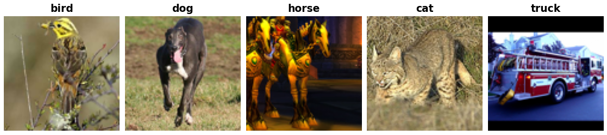

STL-10
======

.. raw:: html

   

   
   
   
   

Overview
--------

The STL-10 dataset is an image recognition dataset for developing unsupervised feature learning, deep learning, and self-taught learning algorithms. It is inspired by the CIFAR-10 dataset but with some modifications. In particular, each class has fewer labeled training examples than in CIFAR-10, but a very large set of unlabeled examples is provided to learn image models prior to supervised training.

**Labeled Splits:**

- **Train**: 5,000 images (500 per class)
- **Test**: 8,000 images (800 per class)

**Unlabeled Split:**

- **Unlabeled**: 100,000 images (label = -1)

Data Structure
--------------

When accessing an example using ``ds[i]``, you will receive a dictionary with the following keys:

.. list-table::
   :header-rows: 1
   :widths: 20 20 60

   * - Key
     - Type
     - Description
   * - ``image``
     - ``PIL.Image.Image``
     - 96×96 RGB image
   * - ``label``
     - int
     - Class label (0-9 for labeled splits, -1 for unlabeled)

**Classes:** airplane, bird, car, cat, deer, dog, horse, monkey, ship, truck

Usage Example
-------------

**Basic Usage**

.. code-block:: python

    from stable_datasets.images.stl10 import STL10

    # First run will download + prepare cache, then return the split as a HF Dataset
    ds_train = STL10(split="train")
    ds_test = STL10(split="test")
    ds_unlabeled = STL10(split="unlabeled")

    # If you omit the split (split=None), you get a DatasetDict with all available splits
    ds_all = STL10(split=None)

    sample = ds_train[0]
    print(sample.keys())  # {"image", "label"}

    # Optional: make it PyTorch-friendly
    ds_train_torch = ds_train.with_format("torch")
    ds_test_torch = ds_test.with_format("torch")

References
----------

- Official website: https://cs.stanford.edu/~acoates/stl10/

Citation
--------

.. code-block:: bibtex

    @inproceedings{coates2011analysis,
      title={An analysis of single-layer networks in unsupervised feature learning},
      author={Coates, Adam and Ng, Andrew and Lee, Honglak},
      booktitle={Proceedings of the fourteenth international conference on artificial intelligence and statistics},
      pages={215--223},
      year={2011},
      organization={JMLR Workshop and Conference Proceedings}
    }

